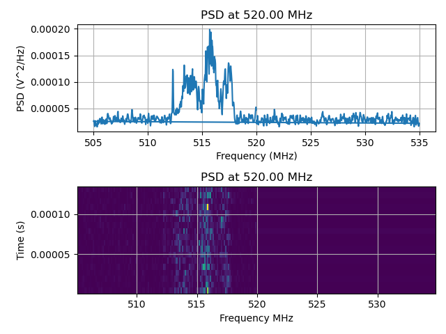
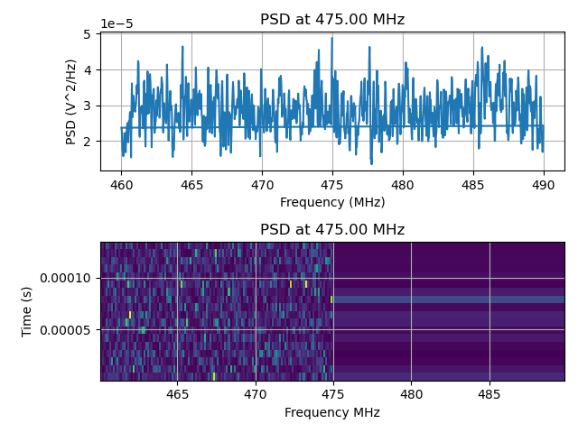

# USRP And Python

This Python script performs a frequency sweep from from 70MHz to 6GHz with a USRP device and records samples at various frequencies. It then analyzes these samples using the Welch method and creates spectrograms and power spectral density (PSD) plots.

**Key Features:**

* Frequency sweep from 70 MHz to 6 GHz in 10 MHz increments.
* Recording of samples in a designated directory.
* Plotting of spectrograms and PSDs using matplotlib.
* Use `joblib` to process plots in parallel.

**Usage:**

1. Ensure that you have installed the necessary libraries `pip install -r requirements.txt`
2. Specify the path to the samples and plots directories in the script.
3. Run the script `python3 main.py`

**Output:**

The script will generate spectrograms and PSD plots for each frequency in the sweep range. The samples will be saved in `samples/` and plots will be saved in `plots/`.

**Notes:**

Depending on your radio to server connection you may experience overflows.  This are apparently very common, as can be seen in [UHD's examples and varied methods of handling them](https://github.com/EttusResearch/uhd/blob/master/host/examples/python/benchmark_rate.py#L235).

Images like this are indicators of overflow, as well as the logs of course.

